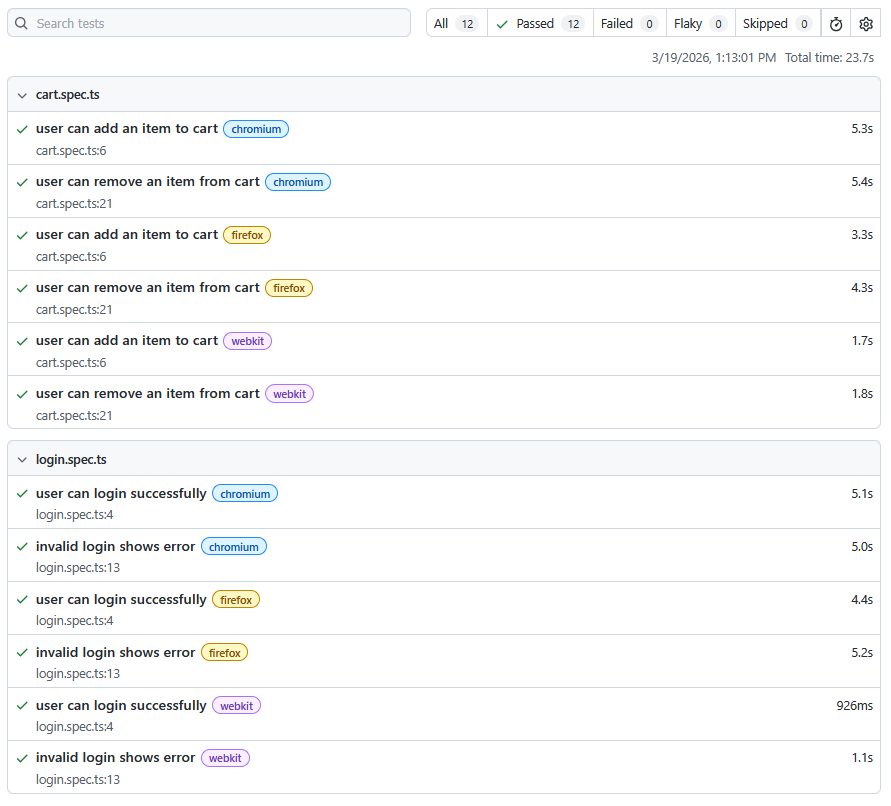
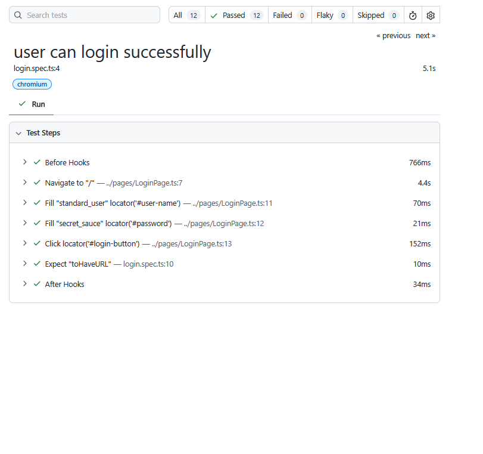
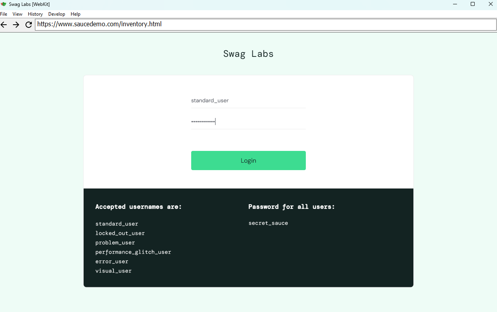

# Playwright E-commerce Test Automation Framework


An end-to-end test automation framework built with Playwright and TypeScript, covering core e-commerce user flows including login, product interaction, and cart functionality.
The framework is designed to reflect real-world QA practices, including reusable test architecture, maintainability, and scalable test design.

This project was built as a portfolio piece to demonstrate practical software testing skills, including UI automation, structured test design, and cross-browser testing. It simulates real-world user journeys and follows best practices used in modern QA and software engineering environments.

## Features

- End-to-end UI test automation
- Cross-browser testing (Chromium, Firefox, WebKit)
- Page Object Model (POM) for maintainable test structure
- Positive and negative test scenarios
- Cart and product interaction testing
- Automated test execution via GitHub Actions
- HTML test reports and debugging support

## Tech Stack

- Playwright
- TypeScript
- Node.js
- GitHub Actions (CI/CD)
- Git / GitHub

## Test Coverage

The framework currently automates the following flows:

### Authentication

- Successful login with valid credentials
- Error handling for invalid login attempts

### Product & Cart

- Add product to cart
- Verify product appears in cart
- Remove product from cart
- Validate cart state updates correctly

## How to Run

Clone the repository
```
git clone https://github.com/HVossie/playwright-ecommerce-test-framework.git
```
Navigate into the project
```
cd playwright-ecommerce-test-framework
```
Install dependencies
```
npm install
```
Install Playwright browsers
```
npx playwright install
```
Run tests
```
npx playwright test
```
Open test report
```
npx playwright show-report
```

## Test Execution

Tests are executed across multiple browsers:

- Chromium
- Firefox
- WebKit

Example command:
```
npx playwright test --headed
```
This allows visual execution of tests for debugging and demonstration purposes.

## Project Structure

```
playwright-ecommerce-test-framework/
├── .github/
│   └── workflows/
│       └── playwright.yml      # CI pipeline for running tests
│
├── pages/                     # Page Object Model classes
│   ├── LoginPage.ts
│   ├── ProductsPage.ts
│   └── CartPage.ts
│
├── tests/                     # Test specifications
│   ├── login.spec.ts
│   └── cart.spec.ts
│
├── playwright.config.ts       # Playwright configuration
├── package.json
├── README.md
└── .gitignore
```
## Test Report Preview

### Test Summary


### Test Details


### Test Execution (Headed Mode)


## What I Learned

- Building end-to-end test automation with Playwright
- Implementing the Page Object Model for scalable test design
- Writing maintainable and reusable test code
- Performing cross-browser testing
- Structuring a real-world automation framework
- Integrating automated tests with GitHub Actions
- Debugging UI tests using Playwright tools and reports

## Possible Improvements

- Add checkout and payment flow testing
- Introduce API testing alongside UI tests
- Implement test data management strategies
- Add parallel test execution configuration
- Improve reporting with custom dashboards
- Expand test coverage for edge cases

## Author
Hanroux